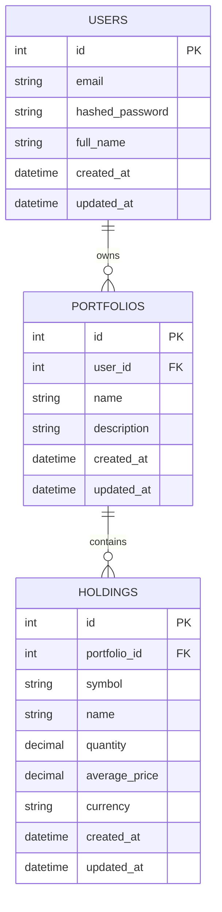

# MarketPulse Database ER Diagram

This ER design supports the MVP portfolio management flow:
- Users sign up and own portfolios
- Each portfolio contains holdings
- Holdings track assets with quantity and average cost
- In future iterations, holdings may become a derived view generated from transaction history rather than directly managed records.
- Future versions may introduce soft deletes using `deleted_at` timestamps for auditability and recovery.
- Future enhancements may include audit logging for portfolio and transaction modifications.

## Entities

### `users`
- `id` (PK)
- `email` (unique)
- `hashed_password`
- `full_name`
- `created_at`
- `updated_at`

### `portfolios`
- `id` (PK)
- `user_id` (FK -> users.id)
- `name`
- `description`
- `created_at`
- `updated_at`

### `holdings`
- `id` (PK)
- `portfolio_id` (FK -> portfolios.id)
- `UNIQUE(portfolio_id, symbol)`
- `symbol`
- `name`
- `asset_type` — `VARCHAR(32)` NOT NULL DEFAULT `stock`
  - supported types: stocks, ETFs, crypto, mutual funds, bonds
- `quantity`
- `average_price`
- `currency`
- `created_at`
- `updated_at`

## Indexes
- `CREATE INDEX idx_portfolios_user_id ON portfolios(user_id);`
- `CREATE INDEX idx_holdings_portfolio_id ON holdings(portfolio_id);`
- `CREATE INDEX idx_holdings_symbol ON holdings(symbol);`

Decimal precision uses `NUMERIC(18, 8)`.

## Relationships

- `users` 1 --- M `portfolios`
- `portfolios` 1 --- M `holdings`

## Mermaid ER Diagram



## SQL Schema

```sql
CREATE TABLE users (
    id SERIAL PRIMARY KEY,
    email VARCHAR(255) NOT NULL UNIQUE,
    hashed_password TEXT NOT NULL,
    full_name VARCHAR(255),
    created_at TIMESTAMPTZ NOT NULL DEFAULT NOW(),
    updated_at TIMESTAMPTZ NOT NULL DEFAULT NOW()
);

CREATE TABLE portfolios (
    id SERIAL PRIMARY KEY,
    user_id INT NOT NULL REFERENCES users(id) ON DELETE CASCADE,
    name VARCHAR(255) NOT NULL,
    description TEXT,
    created_at TIMESTAMPTZ NOT NULL DEFAULT NOW(),
    updated_at TIMESTAMPTZ NOT NULL DEFAULT NOW()
);

CREATE TABLE holdings (
    id SERIAL PRIMARY KEY,
    portfolio_id INT NOT NULL REFERENCES portfolios(id) ON DELETE CASCADE,
    symbol VARCHAR(32) NOT NULL,
    name VARCHAR(255),
    asset_type VARCHAR(32) NOT NULL DEFAULT 'stock',
    quantity NUMERIC(18, 8) NOT NULL,
    average_price NUMERIC(18, 8) NOT NULL,
    currency VARCHAR(8) NOT NULL DEFAULT 'USD',
    created_at TIMESTAMPTZ NOT NULL DEFAULT NOW(),
    updated_at TIMESTAMPTZ NOT NULL DEFAULT NOW(),
    UNIQUE(portfolio_id, symbol)
);
```

Note: `SERIAL` can be replaced with `UUID` primary keys in later iterations.

## Notes

- This model is intentionally simple for Day 1.
- In later iterations, you can add `assets`, `transactions`, and `pricing` tables.
- Use Supabase or Neon for PostgreSQL to host this schema if you prefer not to run Postgres locally.

## Planned future tables
- `assets`
- `transactions`
- `market_prices`
- `watchlists`
- `alerts`
- `recommendations`
- `news_sentiment`
- `import_jobs`

### assets
- `id`
- `symbol`
- `name`
- `exchange`
- `sector`
- `asset_type`
